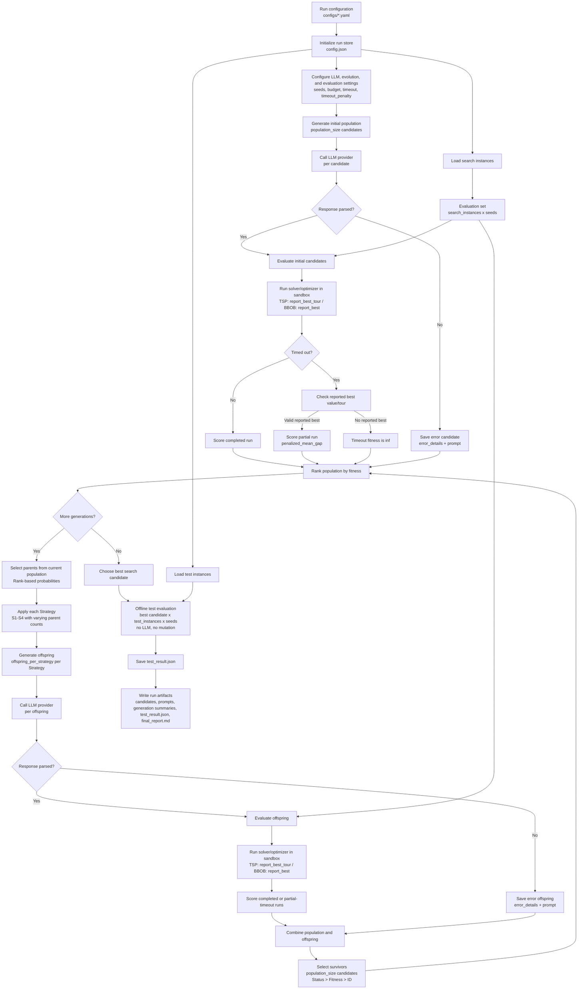

# Framework Flow

```mermaid
flowchart TD
    A[Run configuration<br/>configs/*.yaml] --> B[Initialize run store<br/>config.json]

    B --> C[Load search instances]
    B --> C2[Load test instances]
    B --> D[Configure LLM, evolution, and evaluation settings<br/>seeds, budget, timeout, timeout_penalty]

    C --> E[Evaluation set<br/>search_instances x seeds]
    D --> F[Generate initial population<br/>population_size candidates]

    F --> R[Call LLM provider<br/>per candidate]
    R --> S{Response parsed?}
    S -- No --> S2[Save error candidate<br/>error_details + prompt]
    S -- Yes --> G[Evaluate initial candidates]
    E --> G
    G --> G2[Run solver/optimizer in sandbox<br/>TSP: report_best_tour / BBOB: report_best]
    G2 --> G3{Timed out?}
    G3 -- No --> G4[Score completed run]
    G3 -- Yes --> G5[Check reported best value/tour]
    G5 -- Valid reported best --> G6[Score partial run<br/>penalized_mean_gap]
    G5 -- No reported best --> G7[Timeout fitness is inf]
    G4 --> H[Rank population by fitness]
    G6 --> H
    G7 --> H
    S2 --> H

    H --> I{More generations?}

    I -- Yes --> J[Select parents from current population<br/>Rank-based probabilities]
    J --> K[Apply each Strategy<br/>S1-S4 with varying parent counts]
    K --> L[Generate offspring<br/>offspring_per_strategy per Strategy]
    L --> R2[Call LLM provider<br/>per offspring]
    R2 --> S3{Response parsed?}
    S3 -- No --> S4[Save error offspring<br/>error_details + prompt]
    S3 -- Yes --> M[Evaluate offspring]
    E --> M
    M --> M2[Run solver/optimizer in sandbox<br/>TSP: report_best_tour / BBOB: report_best]
    M2 --> M3[Score completed or partial-timeout runs]
    M3 --> N[Combine population and offspring]
    S4 --> N
    N --> O[Select survivors<br/>population_size candidates<br/>Status > Fitness > ID]
    O --> H

    I -- No --> P[Choose best search candidate]

    P --> T[Offline test evaluation<br/>best candidate x test_instances x seeds<br/>no LLM, no mutation]
    C2 --> T
    T --> T2[Save test_result.json]

    T2 --> Q[Write run artifacts<br/>candidates, prompts, generation summaries, test_result.json, final_report.md]
```